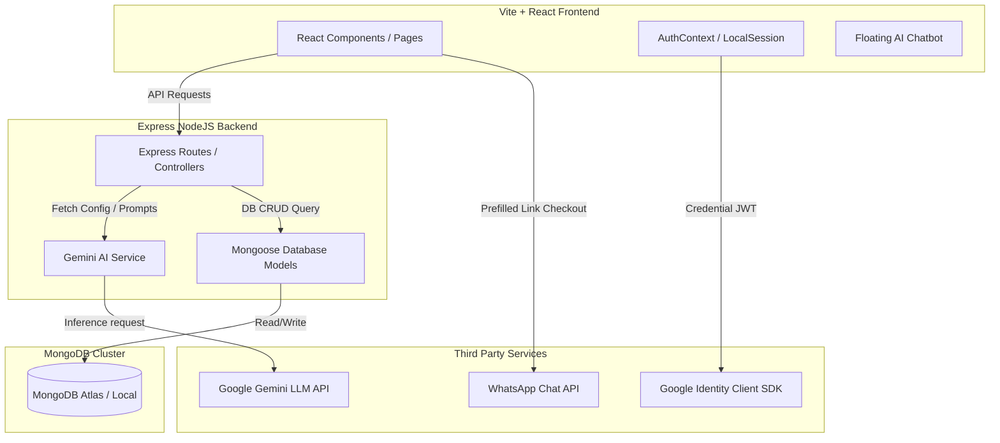
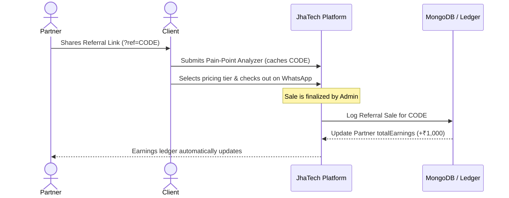

# 🏗️ JhaTech Growth - Project Architecture & Technical Blueprint

This document explains the technical architecture, data flows, technology choices, and design rationale behind the JhaTech Growth platform.

---

## 🗺️ System Architecture

The platform uses a **decoupled Client-Server (MERN) Architecture** with external API integrations. The frontend client communicates with the Node/Express backend via standard REST JSON APIs.

---

## 💾 Data Flow & System Logic

### 1. Business Pain-Point Audit
1. The business owner submits details (challenges, phone, industry) in `PainPointAnalyzer.jsx`.
2. The request is processed by `POST /api/analysis`.
3. The backend checks `GEMINI_API_KEY`:
   - **If active**: Prompts `gemini-1.5-flash` with a system instruction to return a clean JSON object containing custom website features, priority badges, marketing strategies, ROI expectations, and setup costs.
   - **If inactive**: Redirects to the local simulation engine which generates an industry-specific report structure based on the business type (e.g. Saree shop, Kirana store).
4. The result is saved to the `BusinessAnalysis` MongoDB collection and returned to the client.

### 2. Google Identity & Referral Onboarding
1. The user logs in via `AuthModal.jsx`. 
2. The Google GSI library decodes the OAuth token, returning their name, verified Gmail, and profile picture.
3. The frontend triggers `POST /api/partner/google-login` sending the Gmail handle:
   - **User Exists**: The backend returns the existing `Partner` profile containing their referral code and earnings ledger. The dashboard loads.
   - **User is New**: The backend reports `exists: false`. The frontend displays the sign-up form pre-filled with their Google name and email (locks the email field to prevent manipulation). The user enters their UPI ID and WhatsApp number to create a partner account.

### 3. Payout & Commission Ledger Flow

---

## 🛠️ Technology Decisions: "What & Why"

Here is a breakdown of the specific technologies chosen for this project and the engineering rationale behind them:

### 1. Frontend Layer
*   **Vite + React 19**
    *   *What*: A modern frontend build tool paired with the latest version of React.
    *   *Why*: Vite utilizes native ES modules, compiling and hot-reloading code in milliseconds (compared to Webpack which takes seconds to bundle). React 19 introduces optimized memory usage, cleaner hook APIs, and fast client-side rendering.
*   **Tailwind CSS v4 & PostCSS**
    *   *What*: A utility-first CSS framework configured directly inside the stylesheet.
    *   *Why*: Tailwind v4 introduces CSS-first configuration (using `@theme` directives in `index.css`), eliminating compile-time lookups in `tailwind.config.js`. It parses the exact utility classes used in the project, compiling only the active styles into a highly optimized, light stylesheet (`53.24 kB`). This ensures maximum load speed on mobile networks (critical for local retailers in India).
*   **React Router 7 / Lucide Icons**
    *   *What*: Declarative client-side routing library and premium SVG vector icon sets.
    *   *Why*: Client-side routing allows navigating between the home page, pricing calculator, and partner dashboard instantly without reloading the browser (yielding a native-app feel). Lucide React icons scale smoothly on high-resolution displays.

### 2. Backend Server Layer
*   **NodeJS & Express**
    *   *What*: An asynchronous JavaScript runtime environment and minimalist backend framework.
    *   *Why*: NodeJS enables writing JavaScript end-to-end, allowing models and configurations to be shared between backend and frontend. Express is chosen because of its lightweight architecture, high performance in handling I/O operations, and support for standard middleware configurations (like CORS and JSON parsers).
*   **Mongoose ORM**
    *   *What*: A schema-based modeling tool for MongoDB.
    *   *Why*: Enables structural validations on MongoDB data (such as validating phone formats, unique email rules, and ledger properties) before writing data to database clusters.

### 3. Database Layer
*   **MongoDB Atlas**
    *   *What*: A cloud-hosted document-based NoSQL database.
    *   *Why*: Unlike relational SQL databases (which require complex tables, foreign keys, and joins), MongoDB stores records in JSON-like documents. Because audit reports and competitor SWOTs vary depending on the business, document storage accommodates flexible schema models. 
    *   *Resilience Design*: If MongoDB is not running locally or fails to connect, the server automatically starts an **in-memory database fallback** allowing the website to remain fully operational during testing.

### 4. Integration Services
*   **Google Gemini SDK (`gemini-1.5-flash`)**
    *   *What*: Google's lightweight AI model SDK.
    *   *Why*: The `gemini-1.5-flash` model is optimized for high-speed text processing and structured JSON generation, providing real-time consultative audit roadmaps and competitor assessments.
*   **Google Identity Services**
    *   *What*: Modern Google Sign-In SDK.
    *   *Why*: Eliminates the need to maintain user passwords, email verification routes, or database security protocols on credentials. Users authenticate securely with their Gmail, preventing fake partner accounts.
*   **WhatsApp Chat API Integration**
    *   *What*: Direct link syntax (`wa.me`) for instant client-owner messaging.
    *   *Why*: WhatsApp is the most widely used messaging service in India. Generating pre-filled links reduces transaction friction, letting users start conversations with the exact features and pricing they want.
